# SWS304_ASSIGNMENT04

## Lab 1 - Client-Side Prototype Pollution via Browser APIs

### Background
Some browser APIs read URL query parameters and assign them directly to JavaScript objects. If the code does not validate or sanitise keys before assignment, an attacker can inject the string __proto__ as a key, which JavaScript resolves as a reference to Object.prototype rather than a normal property name. This causes the injected property to appear on every object in the application, not just the one created from the URL parameters.
---

## Table of Contents

- [Lab 1 — Client-Side Prototype Pollution via Browser APIs](#lab-1--client-side-prototype-pollution-via-browser-apis)
- [Lab 2 — DOM XSS via Client-Side Prototype Pollution](#lab-2--dom-xss-via-client-side-prototype-pollution)
- [Lab 3 — Privilege Escalation via Server-Side Prototype Pollution](#lab-3--privilege-escalation-via-server-side-prototype-pollution)
- [Lab 4 — Bypassing Flawed Input Filters](#lab-4--bypassing-flawed-input-filters)
- [References](#references)

---

## Lab 1 — Client-Side Prototype Pollution via Browser APIs

### Walkthrough

**Step 1: Explore the vulnerable JavaScript**

I opened the lab and navigated to the Sources tab in DevTools. Inside the `resources/js` folder, I found two relevant files: `deparam.js` and `searchLoggerConfigurable.js`.

In `deparam.js`, the function reads URL query parameters and creates key-value pairs in a plain object without validating whether any key is dangerous. This means if an attacker passes `__proto__` as a key, JavaScript treats it as the special prototype accessor rather than a regular string — allowing direct writes to `Object.prototype`.

In `searchLoggerConfigurable.js`, the code checks whether the `config` object has a `transport_url` property. If it does, it dynamically creates a `<script>` element, sets its `src` to that value, and appends it to the DOM. Since `config` is built from the parsed URL parameters, any property injected into `Object.prototype` becomes visible on `config` through the prototype chain.

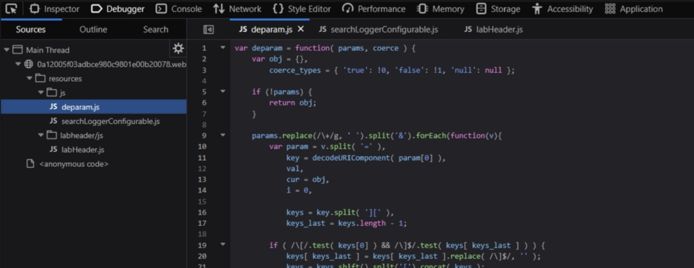

**Step 2: Confirm pollution**

I visited the URL with `/?__proto__[testprop]=polluted` and opened the Console tab. Typing `Object.prototype` revealed the injected `testprop: "polluted"` property — confirming the source is vulnerable.

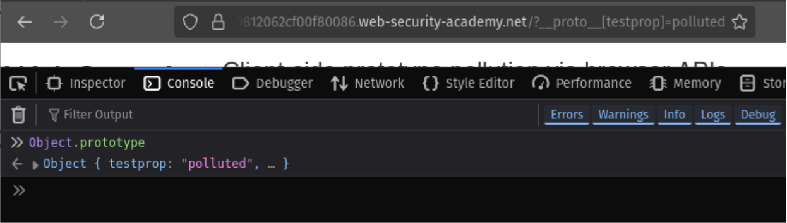

**Step 3: Solve the lab**

With the sink confirmed, I crafted the final payload using a `data:` URI to trigger JavaScript execution:

```
/?__proto__[value]=data:,alert(1);
```

The script tag loaded the `data:` URL, `alert(1)` fired in the browser, and the lab was marked solved.

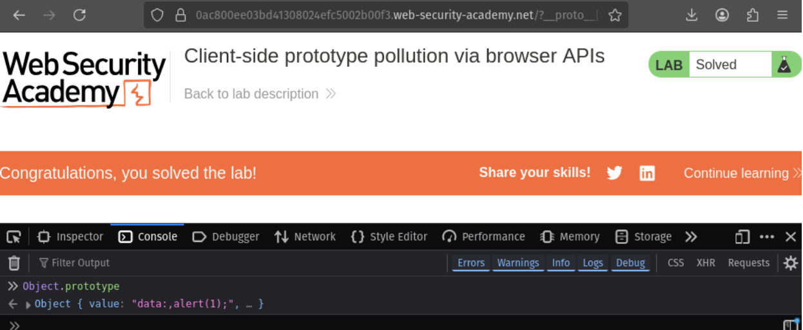

### Summary

The URL parameter parser writes directly to `__proto__` without filtering, polluting `Object.prototype` globally. A separate gadget in `searchLoggerConfigurable.js` then picks up the injected `transport_url` value and loads it as a script source, resulting in DOM-based XSS. A real attacker delivering this URL to a victim could steal session tokens, perform actions on their behalf, or redirect them to a phishing page.

### Questions

**Q1: Why does `?__proto__[x]=y` modify `Object.prototype` and not just the local config object?**

When `deparam.js` processes `?__proto__[x]=y`, JavaScript recognises `__proto__` as the special accessor pointing to an object's prototype. Instead of adding `x` as an own property on the newly created config object, it writes `x` directly onto `Object.prototype` — the shared ancestor of every normal JavaScript object. Because all objects inherit from `Object.prototype` through the prototype chain, the injected property immediately becomes visible across the entire application.

**Q2: Name one defence and explain how it stops the attack.**

A developer could replace the plain `{}` object literal used as the parsing target in `deparam.js` with `Object.create(null)`. This creates an object with no prototype at all. When the parser encounters `__proto__` as a key, there is no prototype slot to traverse — it gets stored as a plain own string property and never touches `Object.prototype`.

---

## Lab 2 — DOM XSS via Client-Side Prototype Pollution

### Walkthrough

**Step 1: Identify the source and sink**

I appended `/?__proto__[foo]=bar` to the lab URL and reloaded the page. In the DevTools Console, I typed `Object.prototype` and saw the injected `foo: "bar"` property — confirming the source vulnerability.

In the Sources tab, I found `searchLogger.js`. Unlike Lab 1, this version uses `Object.defineProperty` to lock `transport_url` as non-configurable and non-writable on the config object itself. However, the script still checks `if(config.transport_url)` before creating a `<script>` tag and setting `script.src` to that value. Since `config.transport_url` is not defined as an own property with a value, JavaScript walks the prototype chain — where our polluted value now lives.

- **Source:** `new URL(location).searchParams` processed through `deparam()`
- **Sink:** `script.src = config.transport_url` followed by `document.body.appendChild(script)`

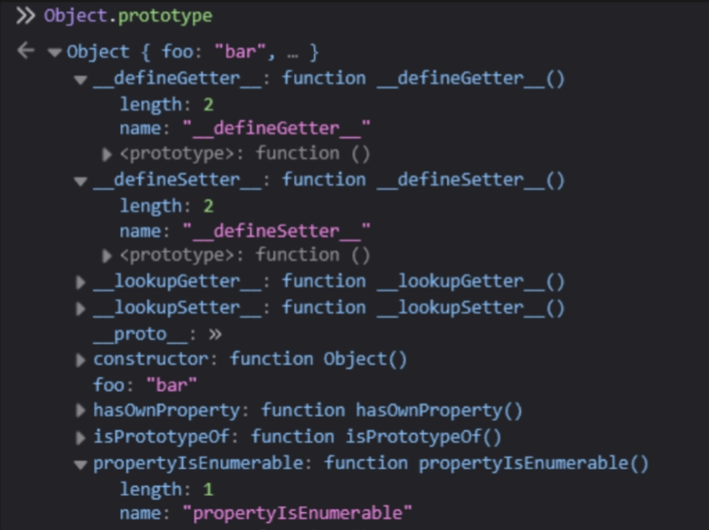

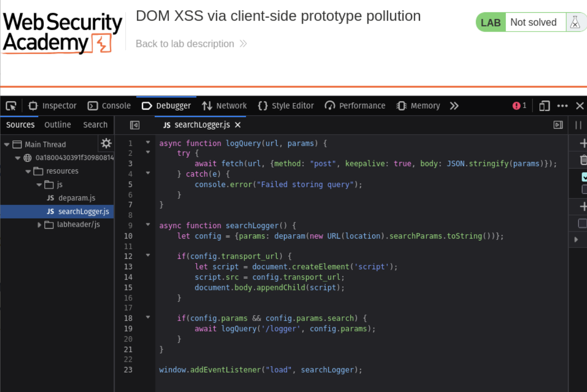

**Step 2: Fire the XSS and solve the lab**

Final payload:

```
/?__proto__[transport_url]=data:,alert(1);
```

The `if(config.transport_url)` check resolved `true` via the prototype chain. The script tag loaded the `data:` URL, `alert(1)` executed, and the lab was solved.

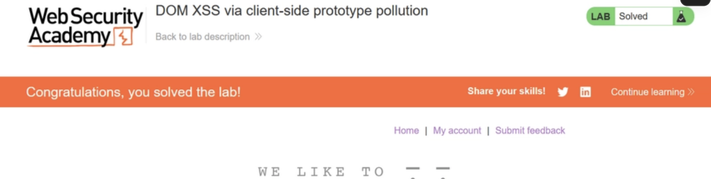

### Summary

The attack plays out in two stages. First, the attacker poisons `Object.prototype` by passing `__proto__[transport_url]` in the URL. Second, the application's own gadget code looks up `config.transport_url`, inherits the polluted value through the prototype chain, and loads it as a script source — resulting in DOM-based XSS. The `Object.defineProperty` call only protects the direct property slot, not prototype chain lookups.

### Questions

**Q1: Why wouldn't injecting directly into the sink work without prototype pollution?**

The application never reads `transport_url` from URL parameters and assigns it to `script.src` directly. The config object is constructed with only a `params` property — `config.transport_url` has no own value. Without prototype pollution, the `if(config.transport_url)` check would be falsy and the script tag would never be created. Prototype pollution is what bridges the gap between the attacker-controlled URL and the DOM sink.

**Q2: Does adding DOMPurify to sanitise `innerHTML` fully fix it?**

No. The XSS in this lab is caused by an attacker-controlled value being assigned to `script.src`, not by `innerHTML`. DOMPurify only sanitises HTML string injection — it does nothing to block prototype pollution or prevent dangerous values from reaching `script.src`. The real fix must target the source: the URL parameter parser must be updated to reject or skip dangerous keys like `__proto__`, `prototype`, and `constructor`. Developers should also consider using `Object.create(null)` for config objects so no prototype chain exists to exploit.

---

## Lab 3 — Privilege Escalation via Server-Side Prototype Pollution

### Walkthrough

**Step 1: Intercept the JSON request**

I logged into the application as user `wiener` with password `peter` and submitted a billing and delivery address change. I intercepted the resulting `POST /my-account/change-address` request in Burp Suite and sent it to Repeater. The response showed `"isAdmin": false`.

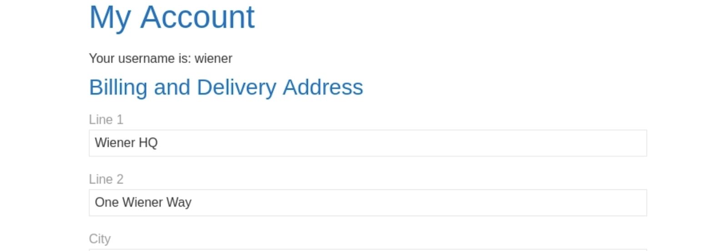

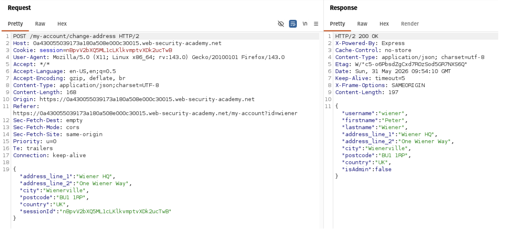

**Step 2: Test for prototype pollution**

In Repeater, I modified the JSON body to include:

```json
"__proto__": {
  "foo": "bar"
}
```

The server responded with the arbitrary `foo` property reflected back — confirming the server's merge function writes `__proto__` contents directly onto `Object.prototype` rather than treating it as a regular key.

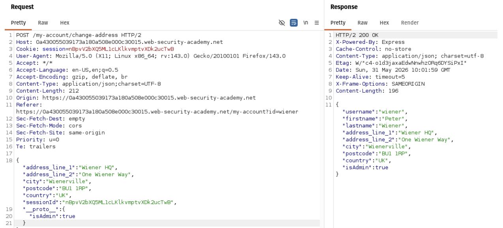

**Step 3: Escalate privileges and solve the lab**

I changed the payload to:

```json
"__proto__": {
  "isAdmin": true
}
```

The response came back with `"isAdmin": true`. I refreshed the page in the browser and found the admin panel link had appeared. I navigated to the admin panel, deleted the user Carlos, and the lab was marked solved.

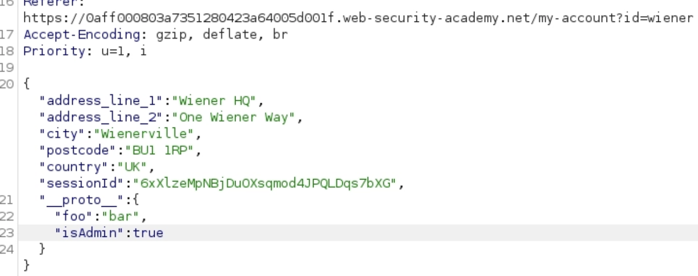

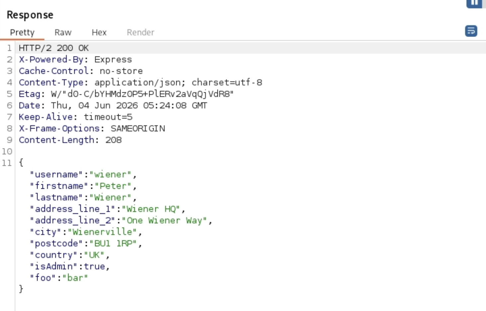


### Summary

The server passes JSON input through an unsafe deep merge function without filtering dangerous keys. When `__proto__` appears in the JSON, the merge function writes its contents directly onto `Object.prototype`. From that point on, all objects created in the Node.js process inherit `isAdmin: true` through the prototype chain — including session objects for every other user. The authorization check then incorrectly treats any regular user as an administrator.

### Questions

**Q1: Why did a single payload affect all objects across the entire Node.js process?**

Node.js runs as a single, long-lived JavaScript runtime. All objects — regardless of which user's request created them — inherit from the same shared `Object.prototype`. Once the payload writes `isAdmin: true` onto `Object.prototype`, that change persists in memory for the lifetime of the process. Every subsequent object created anywhere in the server inherits the polluted property through the prototype chain, affecting all users until the server restarts.

**Q2: What is the correct code-level fix for the vulnerable merge function?**

The merge function must validate and reject dangerous keys before processing. A safe implementation looks like this:

```javascript
function safeMerge(target, source) {
  for (const key of Object.keys(source)) {
    if (key === '__proto__' || key === 'constructor' || key === 'prototype')
      continue;
    if (typeof source[key] === 'object' && source[key] !== null) {
      target[key] = target[key] || {};
      safeMerge(target[key], source[key]);
    } else {
      target[key] = source[key];
    }
  }
}
```

By skipping any key that can reach `Object.prototype`, the function cannot be used to pollute the prototype chain. A stronger approach is to use `Object.create(null)` for target objects — giving them no prototype at all — or to validate JSON input against a strict schema before it ever reaches the merge function.

---

## Lab 4 — Bypassing Flawed Input Filters

### Walkthrough

**Step 1: Confirm `__proto__` is blocked**

I logged in as `wiener` again, submitted a billing address change, and intercepted the request in Burp. In Repeater, I added the same `__proto__` payload from Lab 3:

```json
"__proto__": {
  "isAdmin": true
}
```

The server returned `200 OK` but `isAdmin` remained `false` in the response — the server has a filter blocking direct `__proto__` usage.

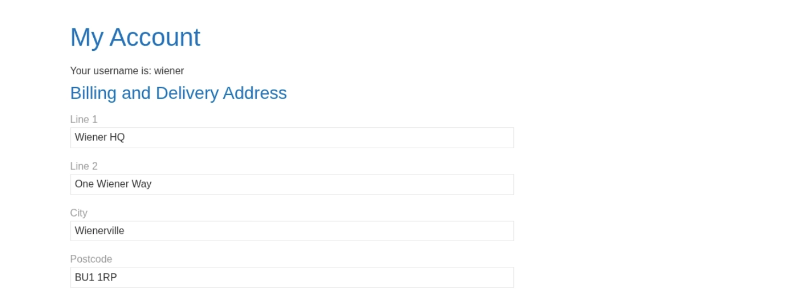

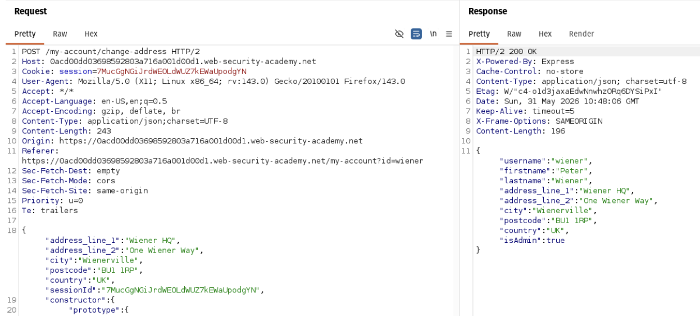

**Step 2: Test `constructor.prototype` to confirm pollution**

Before escalating privileges, I verified that the `constructor.prototype` route actually causes pollution by using a visible side effect:

```json
"constructor": {
  "prototype": {
    "json spaces": 10
  }
}
```

The response came back with dramatically spaced JSON formatting — confirming that `constructor.prototype` successfully reached `Object.prototype` and the pollution worked.

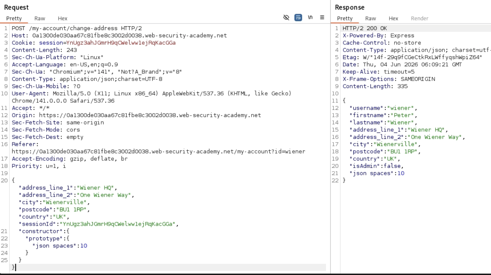

**Step 3: Escalate privileges and solve the lab**

I updated the payload to target `isAdmin`:

```json
"constructor": {
  "prototype": {
    "isAdmin": true
  }
}
```

The response showed `"isAdmin": true`. I refreshed the page, accessed the admin panel, deleted Carlos, and the lab was solved.

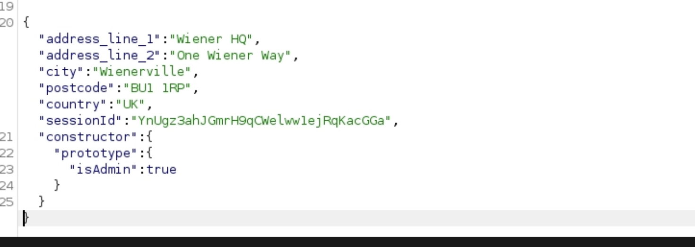

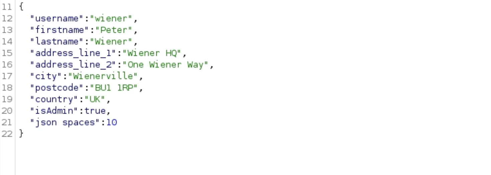

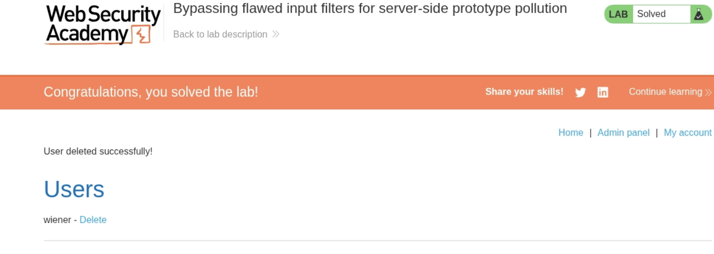

### Summary

The filter failed because it only blocked the literal string `__proto__`. JavaScript provides an alternative path to the same `Object.prototype` through `constructor.prototype`. When the server's merge function encountered `constructor` as a key, it treated it as a normal object and recursively assigned `prototype.isAdmin = true` onto the global prototype. Since both `__proto__` and `constructor.prototype` point to the same `Object.prototype`, the result was identical privilege escalation — with the filter completely bypassed.

### Questions

**Q1: Why does `constructor.prototype` lead to the same `Object.prototype` as `__proto__`?**

In JavaScript, every normal object inherits a `constructor` property pointing to the function that created it — in this case, the built-in `Object` function. That function has a `prototype` property, which is exactly `Object.prototype`. So `constructor.prototype` is just a different route to the same destination. `__proto__` is a direct shortcut; `constructor.prototype` is an indirect path through the constructor function. Both arrive at the shared global prototype, which is why blocking only `__proto__` is never enough.

**Q2: Is blocking `constructor` also sufficient? What does a truly robust fix look like?**

No. Blocklists are inherently fragile — they require developers to anticipate every possible access path, and attackers only need to find one that was missed. Blocking `__proto__` and `constructor` is better than blocking neither, but edge cases, encoding tricks, or future JavaScript features could still provide bypass routes.

A truly robust fix eliminates prototype pollution at the root by avoiding unsafe deep merges into plain objects entirely. The correct approaches are:

- Use a safe merge function that explicitly skips `__proto__`, `constructor`, and `prototype` at every level of recursion.
- Create target objects with `Object.create(null)` so they have no prototype chain to pollute.
- Validate all incoming JSON against a strict allowlist schema before it reaches any merge logic.

Relying on a blocklist alone is not a sustainable security posture.

---

## References

- PortSwigger. (n.d.). *What is prototype pollution?* Web Security Academy. https://portswigger.net/web-security/prototype-pollution  
- Hacker, Z. (2025, Aug 8). *Prototype Pollution.* Medium. https://medium.com/@zodiacHacker/prototype-pollution-b7eb6998149b
